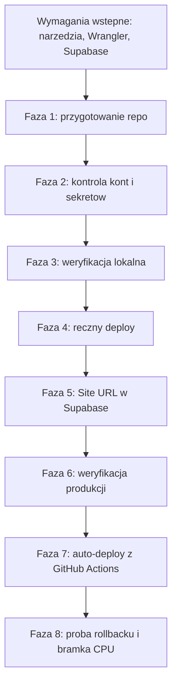

# Plan pierwszego wdrożenia: Cloudflare Workers + Supabase (EU)

Źródła: [context/foundation/infrastructure.md](../foundation/infrastructure.md) (platforma, ryzyka, operacje), [context/foundation/tech-stack.md](../foundation/tech-stack.md) (Astro 7 SSR, `@astrojs/cloudflare` 14, npm, GitHub Actions, auto-deploy-on-merge).

Status: w trakcie wykonania (2026-10-04), fazy 0–6 ukończone, Faza 7 w PR.

## Stan wyjściowy (zweryfikowany 2026-10-04)

- `origin/main` na GitHubie (`miro16/decision-maker`) ma tylko `initial commit`. Cały scaffold, `AGENTS.md`, `.gitattributes` i `context/` są niezacommitowane.
- Wersje: `wrangler` 4.131.1, `astro` 7.3.2, `@astrojs/cloudflare` 14.3.1.
- [wrangler.jsonc](../../wrangler.jsonc) ma `"name": "10x-astro-starter"`.
- [.github/workflows/ci.yml](../../.github/workflows/ci.yml) reaguje tylko na `master`.
- `SUPABASE_URL` i `SUPABASE_KEY` są czytane w runtime przez `astro:env/server` ([src/lib/supabase.ts](../../src/lib/supabase.ts)) i są `optional`, więc build ich nie wymaga.
- [src/pages/api/auth/signup.ts](../../src/pages/api/auth/signup.ts) wywołuje `signUp` bez `emailRedirectTo`. Link potwierdzający prowadzi więc na **Site URL** ustawiony w Supabase.
- Brak kont Cloudflare i Supabase. Brak `gh` CLI. Workers Paid nie jest zadeklarowany, więc startujemy na Free z bramką pomiaru CPU.
- Narzędzia lokalne: Node v24.15.0 (`.nvmrc` mówi 22.14.0), npm 12.2.0, Supabase CLI 2.117.0 przez `npx supabase` (devDependency), Docker Desktop zainstalowany. npm blokuje skrypty instalacyjne `esbuild` i `workerd`.
- [supabase/config.toml](../../supabase/config.toml) ma `project_id = "10x-astro-starter"`, `site_url = "http://127.0.0.1:3000"` i `enable_confirmations = false`. To ustawienia dla lokalnego stacku, nie dla produkcji.

## Wymagania wstępne

Wykonujemy raz, przed Fazą 1. Sekcje 0.2 i 0.3 to zakładanie kont i logowanie, więc robi je człowiek. Agent może podpowiadać komendy i sprawdzać wynik.

### 0.1 Narzędzia lokalne

| Narzędzie | Stan | Co zrobić |
|---|---|---|
| Node.js | v24.15.0 | Podnieść do ≥24.16 (`winget upgrade OpenJS.NodeJS`) albo zainstalować Node 22 ≥22.22.3. Wtyczki `eslint-plugin-astro` i `astro-eslint-parser` wymagają `^22.22.3 \|\| ^24.16.0`. CI używa Node 22. |
| Skrypty instalacyjne npm | zablokowane: `esbuild`, `workerd` | `npm install-scripts approve esbuild workerd`, potem `npm install`. Zmianę konfiguracji, którą zapisze npm, commitujemy razem z Commitem B. Bez tego `astro dev`/`preview` na workerd może nie wystartować. |
| Wrangler | 4.131.1, lokalnie w projekcie | Używać wyłącznie `npx wrangler`, bez instalacji globalnej. Aktualizacja do ≥4.144 jest w Fazie 1. |
| Supabase CLI | 2.117.0, lokalnie w projekcie | Używać `npx supabase`, bez instalacji globalnej. |
| Docker Desktop | zainstalowany | Potrzebny tylko do lokalnego Supabase (`npx supabase start`, ok. 7 GB RAM). Pełny smoke i tak działa w CI. |
| GitHub CLI | brak | `winget install --id GitHub.cli`, potem `gh auth login` (GitHub.com, HTTPS, logowanie przez przeglądarkę) i `gh auth status`. Potrzebny do sekretów, PR i logów CI w Fazie 7. |

### 0.2 Cloudflare i Wrangler

1. Założyć konto na dash.cloudflare.com (plan Free) i potwierdzić e-mail. Bez potwierdzonego maila deploy Workera się nie uda.
2. `npx wrangler login` otwiera przeglądarkę z autoryzacją OAuth, a callback trafia na `localhost`. Zezwolić na dostęp. Token zostaje w konfiguracji użytkownika, nie w repo.
3. `npx wrangler whoami` powinno pokazać e-mail i **Account ID**. Account ID zapisać do Fazy 7 (sekret `CLOUDFLARE_ACCOUNT_ID`).
4. Subdomeny `*.workers.dev` nie zakładamy teraz. Wrangler zapyta o nią przy pierwszym `npx wrangler deploy` w Fazie 4.
5. Na maszynie bez przeglądarki (np. CI) zamiast `wrangler login` używamy zmiennych `CLOUDFLARE_API_TOKEN` i `CLOUDFLARE_ACCOUNT_ID`. Token powstaje w Fazie 7.

### 0.3 Supabase: projekt hostowany i CLI

1. Założyć konto na supabase.com i organizację (plan Free).
2. Utworzyć projekt `decision-maker` w regionie **Central EU (Frankfurt)**. Hasło do bazy wygenerować i zapisać w menedżerze haseł. Jest potrzebne do `supabase link` i nie da się go później odczytać, tylko zresetować.
3. Project Settings, API Keys: skopiować **Project URL** oraz klucz **publishable** (`sb_publishable_...`) albo starszy **anon**. Ten klucz trafia do `SUPABASE_KEY`. Nigdy nie używać klucza `secret` ani `service_role`, bo omija RLS.
4. Authentication, Sign In / Providers: provider Email włączony, **Confirm email włączone** (na produkcji zostaje włączone). Site URL i Redirect URLs ustawiamy dopiero w Fazie 5, gdy znamy URL Workera.
5. Powiązać CLI z projektem, co przyda się do przyszłych migracji:
   - `npx supabase login`: otwiera przeglądarkę i zapisuje token dostępu lokalnie. Bez przeglądarki: zmienna `SUPABASE_ACCESS_TOKEN`.
   - `npx supabase link --project-ref <ref>`: `<ref>` to fragment Project URL przed `.supabase.co`. CLI zapyta o hasło do bazy z kroku 2.
   - `npx supabase projects list`: powiązany projekt jest oznaczony.
6. **Nie uruchamiać `npx supabase config push`** z obecnym `supabase/config.toml`. Wysłałby na produkcję `site_url = http://127.0.0.1:3000` i wyłączone potwierdzanie maila. Ustawienia auth produkcji zmieniamy tylko w panelu.
7. Opcjonalnie, dla lokalnego Supabase: zmienić `project_id` w `supabase/config.toml` na `decision-maker`. Od niego zależą nazwy kontenerów Dockera. Zmiana trafia do Commitu B.

### 0.4 Lokalne pliki z sekretami

- `.env` (Node) i `.dev.vars` (workerd), oba gitignored: `SUPABASE_URL=<Project URL>` i `SUPABASE_KEY=<publishable/anon>`. Wzór jest w `.env.example`.
- Uwaga: te wartości wskazują produkcyjny projekt. Lokalnie niczego nie rejestrujemy (patrz Faza 3). Do testów z rejestracją używamy lokalnego Supabase (`npx supabase start`), wtedy w obu plikach wpisujemy URL i klucz wypisane przez CLI.

### 0.5 Kontrola gotowości

Wszystkie poniższe komendy muszą przejść przed Fazą 1:

- `node --version`: ≥24.16 albo ≥22.22.3
- `npm install-scripts ls`: brak zablokowanych pakietów
- `npx wrangler whoami`: zalogowane konto i Account ID
- `npx supabase projects list`: projekt `decision-maker` powiązany
- `gh auth status`: zalogowany do github.com z dostępem do `miro16/decision-maker`
- `.env` i `.dev.vars` istnieją, a `git status` ich nie pokazuje

## Ocena planu bazowego: znalezione braki i poprawki

Plan bazowy to sekcja "Getting Started" z `infrastructure.md`.

- **Smoke na produkcji.** Plan bazowy uruchamia `npm run smoke` na URL produkcyjnym. Smoke zakłada konta i wymaga wyłączonego potwierdzania e-maila, więc na produkcji albo padnie, albo zaśmieci bazę. **Poprawka:** pełny smoke działa tylko w CI (lokalny Supabase w runnerze). Na produkcji robimy check HTTP tylko do odczytu i jedną ręczną rejestrację.
- **Smoke lokalny na hostowanym Supabase.** Krok 3 planu bazowego tworzyłby użytkowników w produkcyjnym projekcie. **Poprawka:** lokalnie tylko `build` + `preview` + ręczne sprawdzenie stron bez rejestracji.
- **Brak Site URL i redirect URLs w Supabase.** Bez nich link z maila prowadzi na `localhost`. **Poprawka:** osobny krok konfiguracji auth po poznaniu URL `*.workers.dev`.
- **Brak commita i pusha scaffoldu.** Bez tego CI nie ma czego budować. **Poprawka:** dwa commity bezpośrednio na `main` przed workflow deployu.
- **Trigger CI na `master`.** **Poprawka:** zmiana na `main` przed dodaniem joba deploy.
- **Brak tokenu API Cloudflare dla CI.** **Poprawka:** token z minimalnym uprawnieniem "Edit Cloudflare Workers" plus Account ID w sekretach GitHuba.
- **Limit wysyłki maili Supabase.** Wbudowany SMTP ma niski limit godzinowy. **Poprawka:** wpis w ryzykach. Na MVP wystarczy, a custom SMTP rozważymy później.
- **Pierwszy deploy na `*.workers.dev` wymaga rejestracji subdomeny konta.** **Poprawka:** jawny krok przy `wrangler deploy` (interaktywny, tylko człowiek).
- **Brak próby rollbacku.** **Poprawka:** jedna kontrolowana próba po drugim deployu.

## Przebieg

### Faza 1: przygotowanie repo (agent)

1. Zmienić `"name"` w `wrangler.jsonc` na `"decision-maker"`.
2. Uruchomić `npm install -D wrangler@latest`, z celem ≥4.144. Potem `npm audit` i porównanie z `context/changes/bootstrap-verification/verification.md`.
3. Usunąć `CLAUDE.md.scaffold`, bo jego treść jest już w `AGENTS.md`.
4. Bramki: `npm run lint`, `npx astro check`, `npm run build`.
5. Commit A, scaffold i dokumenty: `chore: scaffold 10x-astro-starter, AGENTS.md, foundation docs`. Commit B, przygotowanie deployu: `chore: prepare Cloudflare Workers deploy (worker name, wrangler upgrade)`. Push na `main` po akceptacji człowieka. `ci.yml` wciąż reaguje na `master`, więc nic się nie uruchomi.

### Faza 2: kontrola kont i sekretów (agent sprawdza)

1. Konta i logowanie są w sekcjach 0.2–0.4. Tu tylko powtarzamy kontrolę gotowości 0.5 po zmianach z Fazy 1, czyli po aktualizacji Wranglera.
2. Sekretów Workera nie da się ustawić, zanim Worker istnieje, dlatego robimy to w Fazie 4.

### Faza 3: weryfikacja lokalna (agent)

1. `npm run build`, potem `npm run preview`. Preview działa na workerd.
2. Sprawdzić ręcznie: `/` zwraca 200, `/auth/signin` się renderuje, `/dashboard` przekierowuje na `/auth/signin`. Bez rejestracji, żeby nie tworzyć kont w produkcyjnym Supabase.

### Faza 4: ręczny deploy (człowiek zatwierdza, agent prowadzi)

1. `npx wrangler deploy --dry-run`: sprawdzenie bundla i bindingów. Adapter auto-provisionuje KV `SESSION` i `IMAGES`. Zostawiamy je i nigdy nie usuwamy, bo usunięcie blokuje rollback.
2. `npx wrangler deploy`. Przy pierwszym razie człowiek rejestruje subdomenę `*.workers.dev`. Notujemy URL `https://decision-maker..workers.dev`.
3. `npx wrangler secret put SUPABASE_URL` i `npx wrangler secret put SUPABASE_KEY`. Sekrety działają od następnego requestu, bez redeployu.

### Faza 5: konfiguracja auth w Supabase (człowiek)

- Authentication, URL Configuration: **Site URL** = URL z fazy 4. **Redirect URLs** = ten sam URL oraz `http://localhost:4321/**` dla lokalnego dev.

### Faza 6: weryfikacja produkcji (agent czyta, człowiek klika)

1. Check HTTP: `/` zwraca 200, `/dashboard` zwraca 302 na `/auth/signin`.
2. Człowiek przechodzi ścieżkę: rejestracja, mail, potwierdzenie (ląduje na Site URL), logowanie, `/dashboard`, wylogowanie.
3. `npx wrangler tail --format json` w trakcie, żeby wyłapać błędy i ewentualne 1102.

### Faza 7: auto-deploy z GitHub Actions (agent, przez PR)

1. W `.github/workflows/ci.yml` zmienić triggery `push` i `pull_request` z `master` na `main`.
2. Dodać job `deploy` z `needs: [ci, smoke]` i warunkiem `if: github.event_name == 'push' && github.ref == 'refs/heads/main'`. Kroki: `npm ci`, `npm run build`, `npx wrangler deploy`. Env: `CLOUDFLARE_API_TOKEN`, `CLOUDFLARE_ACCOUNT_ID`. Sekrety Supabase nie są potrzebne, bo są już w Workerze.
3. Człowiek tworzy token Cloudflare (szablon "Edit Cloudflare Workers", tylko to konto) i dodaje w GitHub, Settings, Secrets: `CLOUDFLARE_API_TOKEN`, `CLOUDFLARE_ACCOUNT_ID`, `SUPABASE_URL`, `SUPABASE_KEY` (dla kroku build w jobie `ci`). Przez UI albo `winget install GitHub.cli` i `gh secret set`.
4. Zmianę wprowadzamy przez branch i PR. Na PR uruchamiają się `ci` i `smoke`. Merge do `main` (zatwierdzenie przez człowieka) uruchamia pierwszy automatyczny deploy.

### Faza 8: próba rollbacku i bramka CPU (człowiek zatwierdza)

1. `npx wrangler deployments list`, potem `npx wrangler rollback <poprzednia-wersja>`, sprawdzenie `/`, następnie rollback z powrotem do najnowszej. Notujemy czas.
2. Po tygodniu ruchu sprawdzić CPU time per request w Workers Observability. Jeśli p95 przekracza 7 ms albo pojawi się jakikolwiek 1102, przejść na Workers Paid (5 USD/mies.).

## Granice uprawnień

- Agent bez zgody: build, lint, check, preview, `--dry-run`, `wrangler tail`, `deployments list`, edycje plików, PR.
- Tylko człowiek lub za jego zgodą: zakładanie kont, `wrangler login`, `supabase login`/`link`, `gh auth login`, `wrangler deploy` (ręczny), `secret put`, push na `main`, merge PR, rollback, tworzenie tokenu API, zmiany w dashboardzie Supabase.

## Definicja ukończenia

- Worker `decision-maker` odpowiada pod `*.workers.dev`. Rejestracja z potwierdzeniem mailowym, logowanie i `/dashboard` działają na produkcji.
- Merge do `main` sam wdraża, po zielonych `ci` i `smoke`.
- Rollback przećwiczony. Wynik pomiaru CPU zapisany.
- Ten plik uzupełniony o URL, datę i wyniki weryfikacji w sekcji "Dziennik wykonania". W `context/foundation/infrastructure.md` poprawione kroki 3 i 4 "Getting Started", czyli smoke tylko w CI.

## Poza zakresem

Własna domena, osobny projekt Supabase dla preview, Cloudflare Access, custom SMTP, migracje bazy (tabele decyzji powstaną przy implementacji FR-003 i dalszych).

## Dziennik wykonania

| Faza | Data | Wynik | Uwagi |
|---|---|---|---|
| 0. Wymagania wstępne | 2026-10-04 | OK | Account ID: `e363d8ddfb0cda2fac3be36413230334`, project ref: `basuknhuxhspqreugnzc` (eu-central-1; pierwszy projekt powstał w eu-west-1 i został zastąpiony). Node 24.19.0, gh 2.102.0 (fine-grained PAT: Contents/Workflows/Secrets/PR RW, Actions R). `supabase link` nie pytał o hasło. Repo zmienione na publiczne. |
| 1. Przygotowanie repo | 2026-10-04 | OK | Commity `2eedc0e` (scaffold) i `887a6ee` (deploy prep) na `main`. Wrangler 4.147.0, `npm audit fix` → 0 podatności. `allowScripts` przypina wersje `workerd`, więc po każdym bumpie Wranglera: `npm install-scripts approve workerd`. |
| 2. Kontrola kont i sekretów | 2026-10-04 | OK | Wrangler 4.147.0 zachował logowanie OAuth. |
| 3. Weryfikacja lokalna | 2026-10-04 | OK | Preview: `/`, `/auth/signin`, `/auth/signup` 200, `/dashboard` 302 → `/auth/signin`, brak banera konfiguracji. |
| 4. Ręczny deploy | 2026-10-04 | OK | URL: https://decision-maker.mmiro1.workers.dev (subdomena konta `mmiro1`). Wersja `c0751666-fa83-4ef3-8cf6-e0f1344ec21b`. KV `decision-maker-session` (`1dd4d62f0a6b4b9ab66054ee2558130d`) auto-provisioned, nie usuwać. Wrangler przeformatowuje `wrangler.jsonc` przy provisioningu, zmianę odrzucono. Sekrety `SUPABASE_URL`/`SUPABASE_KEY` ustawione, baner zniknął. |
| 5. Auth w Supabase | 2026-10-04 | OK | Site URL `https://decision-maker.mmiro1.workers.dev`, Redirect URLs: `https://decision-maker.mmiro1.workers.dev/**`, `http://localhost:4321/**`. Confirm email włączone. |
| 6. Weryfikacja produkcji | 2026-10-04 | OK | Rejestracja → mail → potwierdzenie → logowanie → `/dashboard` → wylogowanie. `wrangler tail`: 11 requestów, wszystkie `ok`, 0× 5xx, 0× 1102. CPU: śr. 11 ms, max 56 ms (`GET /auth/signup`, pierwsze wejście), `GET /` zalogowany 11 ms. 5 z 11 requestów przekracza próg p95 7 ms z Fazy 8. |
| 7. Auto-deploy z CI | | | |
| 8. Rollback i bramka CPU | | | CPU p95: |
